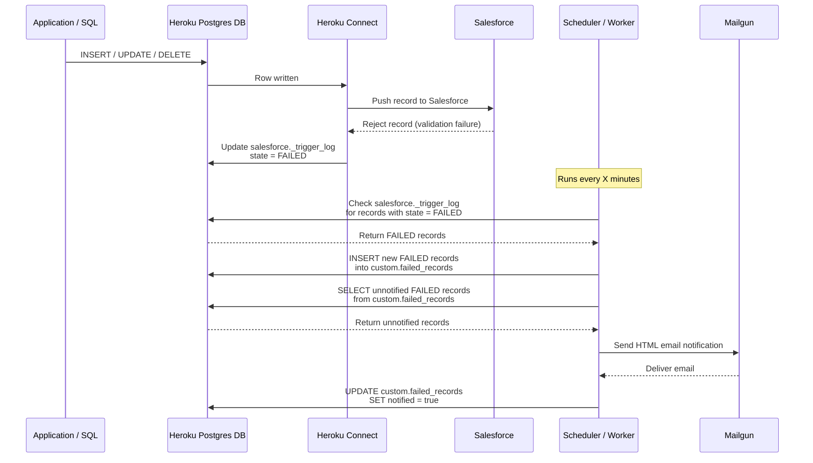
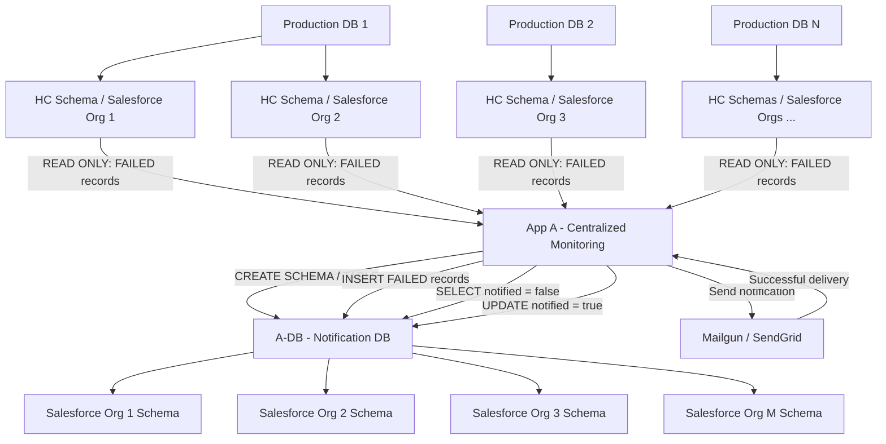

# Heroku Connect Failure Monitor — POC

## Disclaimer

**The information provided in this repository is for informational and demonstration purposes only.** While reasonable efforts have been made to ensure the accuracy and completeness of the information, no warranties or guarantees are made regarding its reliability, accuracy, or completeness.

**Any actions taken based on the information provided are undertaken at your own risk.** The author shall not be held responsible or liable for any loss, damage, or other consequences arising from the use of this information.

**None of the tools, scripts, configurations, or other materials included in this repository are part of the Heroku Services or official Heroku product offerings. They are provided as examples or custom solutions and should be evaluated and tested appropriately before use in any environment.**

---

## Deploy to Heroku

This application can be deployed directly to Heroku using the Deploy to Heroku button.

[](https://www.heroku.com/deploy?template=https://github.com/<YOUR_ORG>/<YOUR_REPOSITORY>)

The Deploy to Heroku flow creates the centralized monitoring application (App A). The application requires access to:

- A centralized Notification Database (A-DB)
- One or more production Heroku Postgres databases
- The relevant Heroku Connect schemas
- A Mailgun account/domain for email notifications

### Required Config Vars

The following Config Vars are required during deployment:

| Config Var | Description |
|---|---|
| `DATABASE_URL` | Connection URL for the centralized Notification DB (A-DB) |
| `MAILGUN_API_KEY` | Mailgun API key |
| `MAILGUN_DOMAIN` | Mailgun sending domain |
| `ALERT_EMAIL_TO` | Email address for failure notifications |

### Production Database Configuration

Production database connections are configured using the following naming convention:

```text
database_url_<app_name>_<dbid>
schema_<app_name>_<dbid>_<salesforceOrgID>
```

---

## Best Practices

* **Use a separate application and database for the notification system.** This provides clear separation between production application workloads and the monitoring/notification workload.

* **Use read-only access to production databases.** The notification application should have read-only access to the production databases for example, `app1`, `app2`, and other production applications, including the relevant Heroku Connect schemas. The notification system should only read failure information from the production environments.

* **Perform all write operations only on the notification database.** Schema/table creation and `INSERT`, `UPDATE`, and `DELETE` operations required by the notification process should be performed only on the dedicated notification system database. Production databases should not be modified by the notification application.

* **For Common Runtime applications, use the standard connectivity model.** The notification application can connect to the relevant production Heroku Postgres databases using their configured connection details and appropriate access controls.

* **For applications, Heroku Connect integrations, and databases running in a Heroku Private Space, deploy the notification application in the same Private Space.** This keeps the notification system within the same network boundary as the production resources it monitors while maintaining separation from the production workloads.

* **If applications, Heroku Connect integrations, and databases are deployed in different Private or Shield Spaces and need to connect to Heroku Postgres databases across those Private or Shield Spaces, consider using Mutual TLS (mTLS)** to establish a mutually authenticated connection, along with the required IP allowlisting. See the [Heroku Postgres mTLS documentation](https://devcenter.heroku.com/articles/heroku-postgres-via-mtls) for configuration details and limitations.

---

# Heroku Connect Failure Monitor — Architecture I - Single App / Salesforce Org / HC Schema

The first architecture uses a **single Heroku Postgres database** for both Heroku Connect synchronization data and failure monitoring. Application changes are written to the database and synchronized to Salesforce through Heroku Connect. If Salesforce rejects a record, Heroku Connect updates `salesforce._trigger_log` with `state = 'FAILED'`.

The scheduled worker, `process_failed_records.js`, runs periodically and checks `salesforce._trigger_log` for failed synchronization records. It stores new failures in `custom.failed_records`, retrieves records where `notified = false`, and sends an HTML email notification through SendGrid or Mailgun. After successful email delivery, the worker updates the corresponding records and sets `notified = true`.

In this architecture, the **same Heroku Postgres database is used for both reading Heroku Connect failure information and storing notification records**, while `process_failed_records.js` provides the scheduled monitoring and notification functionality.


## Flow

```text
salesforce._trigger_log
        │
        │ SELECT state = 'FAILED'
        ▼
custom.failed_records
        │
        │ WHERE notified = false
        ▼
SendGrid / Mailgun Email
        │
        ▼
UPDATE notified = true
```

## Architecture Flow



## Components

* **Application / SQL**
* **Heroku Postgres DB**
* **Heroku Connect**
* **Salesforce**
* **Scheduler / Worker**
* **Mailgun**

## Detailed Flow

1. The application performs an `INSERT`, `UPDATE`, or `DELETE` operation on a Postgres table.

2. The row is written to the Heroku Postgres database.

3. Heroku Connect detects the change and processes the record for synchronization with Salesforce.

4. Heroku Connect attempts to push the record to Salesforce.

5. Salesforce rejects the record, for example, due to a validation rule failure.

6. Heroku Connect updates the corresponding entry in:

   ```text
   salesforce._trigger_log
   ```

   with:

   ```text
   state = FAILED
   ```

7. The Scheduler / Worker runs every X minutes and checks:

   ```text
   salesforce._trigger_log
   ```

   for records with:

   ```text
   state = FAILED
   ```

8. Newly detected failed records are inserted into:

   ```text
   custom.failed_records
   ```

9. The Scheduler / Worker selects failed records that have not yet been notified:

   ```sql
   SELECT *
   FROM custom.failed_records
   WHERE notified = false;
   ```

10. The system sends an HTML email notification through Mailgun.

11. Mailgun delivers the email to the configured recipients.

12. After the notification is successfully processed, the system updates:

```text
custom.failed_records
```

and sets:

```text
notified = true
```

---

# Heroku Connect Failure Monitor — Architecture II - Multi-App / Multi-Salesforce Org / Multi-HC Schema

## 1. Architecture Overview

The new architecture uses **one centralized monitoring application (App A)** to monitor multiple production environments. Each production application can have one or more production databases, and each production database can have one or more Heroku Connect schemas, with each schema associated with a Salesforce Org. App A uses Config Vars for database DATABASE_URL and the other production applications databases following the `database_url_<app_name>_<dbid>` and `schema_<app_name>_<dbid>_<salesforceOrgID>` naming convention to identify the appropriate production database and Heroku Connect schema, reads `FAILED` records from each `<schema>._trigger_log`, and writes them to a centralized **Notification DB (A-DB)**. A-DB maintains separate schemas for each Salesforce Org, allowing failure records to remain logically isolated. App A then retrieves unnotified failures from the appropriate A-DB schema, sends email notifications through Mailgun/SendGrid, and marks successfully notified records as `notified = true`.

Production databases are **read-only from App A's perspective**. All schema/table creation, inserts, selects for notification processing, and updates to `notified` are performed only on the central A-DB.

---

## 2. Architecture Flow



The production databases are read-only sources. All schema creation and notification-record DML is performed on A-DB.

## 3. Flow

### Current

```text
                 DATABASE_URL
                      │
             ┌────────┴────────┐
             │                 │
           READ              WRITE
             │                 │
     _trigger_log       failed_records
             │                 │
             └────────┬────────┘
                      │
                   Mailgun
```

### New

```text
                  database_url_app1_db1
                          │
                 ┌────────┴────────┐
                 │                 │
                 ▼                 ▼
 schema_app1_db1_salesforceOrg1   schema_app1_db1_salesforceOrg2
                 │                 │
                 ▼                 ▼
          FAILED records     FAILED records
                 │                 │
                 └────────┬────────┘
                          │
                          ▼
                        App A
                          │
                          ▼
                         A-DB
                    ┌─────┴─────┐
                    │           │
                    ▼           ▼
              Org1 schema   Org2 schema
                    │           │
                    └─────┬─────┘
                          │
                          ▼
                       Mailgun
```

The **Mailgun logic remains largely unchanged**. The major refactoring is the database/configuration layer: multiple read-only production DB connections, a single read/write A-DB connection, dynamic source/schema discovery, A-DB schema provisioning, and independent processing per Salesforce Org.

---

## 4. Database Permission Model

### Production Databases

App A should have **read-only access** to the relevant Heroku Connect schemas:

```text
Production DB 1
├── salesforce._trigger_log    ← READ ONLY
└── ...

Production DB 2
├── salesforce._trigger_log    ← READ ONLY
└── ...

Production DB N
└── ...
```

App A should not perform:

```text
INSERT
UPDATE
DELETE
CREATE
ALTER
DROP
```

against production databases.

### A-DB

App A has the required read/write permissions on the centralized Notification DB:

```text
A-DB
├── salesforceOrg1.failed_records
├── salesforceOrg2.failed_records
├── salesforceOrg3.failed_records
└── ...
```

Normal runtime operations are:

```text
CREATE SCHEMA / TABLE → Provisioning
INSERT                 → Store new FAILED records
SELECT                 → Retrieve unnotified records
UPDATE                 → Set notified = true
```

If dynamic schema/table provisioning is enabled, the A-DB credentials need the required DDL privileges.

---

## 5. What Would the Code Changes Be?

The main code change is to separate the **source database connections** from the **central notification DB connection**. The current implementation uses one `DATABASE_URL` for both reading `salesforce._trigger_log` and writing `custom.failed_records`. The new implementation uses `DATABASE_URL` only for the central Notification DB (A-DB), while production database connections are discovered from Config Vars and used only for reading Heroku Connect `_trigger_log` tables.

### 5.1 Configuration Changes

Use the following Config Var convention:

```text
DATABASE_URL          # Central Notification DB (A-DB)

database_url_app1    # Production DB for app1
database_url_app2    # Production DB for app2
...

schema_app1_salesforceOrg1 = salesforce
schema_app1_db1_salesforceOrg2 = salesforce
schema_app2_salesforceOrg3 = salesforce
...
```

The configuration convention is:

```text
database_url_<app_name>_<dbid>
schema_<app_name>_<dbid>_<salesforceOrgID>
```

The **Config Var name identifies the application, database, and Salesforce Org**, while the **Config Var value contains the actual production database connection URL or Heroku Connect schema name**.

For example:

```text
database_url_app1_db1
schema_app1_db1_salesforceOrg1 = salesforce
schema_app1_db1_salesforceOrg2 = salesforce

database_url_app2_db1
schema_app2_db1_salesforceOrg3 = salesforce
```

This supports multiple databases within the same application and multiple Salesforce Orgs/Heroku Connect schemas within each database:

```text
Application 1
├── Production DB 1
│   ├── salesforce._trigger_log → Salesforce Org 1
│   └── salesforce._trigger_log → Salesforce Org 2
└── Production DB 2
    └── salesforce._trigger_log → Salesforce Org 3
```

The Config Var name provides the logical application, database, and Salesforce Org identity even when the source schema name is identical.

---

### 5.2 Database Connection Model

The application uses two types of database connections.

#### Central Notification DB — Read/Write

```js
const notificationPool = new Pool({
  connectionString: DATABASE_URL,
  ssl: DATABASE_URL?.includes('localhost')
    ? false
    : { rejectUnauthorized: false }
});
```

`DATABASE_URL` points only to A-DB.

#### Production DBs — Read Only

A separate connection pool is created for each configured production database:

```js
const sourcePools = new Map();

function getSourcePool(appName, dbId, databaseUrl) {
  const poolKey = `${appName}_${dbId}`;

  if (!sourcePools.has(poolKey)) {
    sourcePools.set(
      poolKey,
      new Pool({
        connectionString: databaseUrl,
        ssl: databaseUrl.includes('localhost')
          ? false
          : { rejectUnauthorized: false }
      })
    );
  }

  return sourcePools.get(poolKey);
}
```

The production database credentials used by App A should have **read-only permissions**.

App A performs `SELECT` operations against production databases but does not perform `INSERT`, `UPDATE`, `DELETE`, `CREATE`, `ALTER`, or `DROP` operations there.

---

### 5.3 Discover the Configured Source Schemas

The application discovers `schema_<app_name>_<salesforceOrgID>` Config Vars from `process.env`.

```js
function loadSourceConfig() {
  const sources = [];

  for (const key of Object.keys(process.env)) {
    if (!key.startsWith('schema_')) continue;

    const match = key.match(
      /^schema_(.+)_(.+)_(salesforceOrg[^_]+)$/
    );

    if (!match) {
      console.warn(`Ignoring invalid schema Config Var: ${key}`);
      continue;
    }

    const [, appName, dbId, salesforceOrgId] = match;

    const databaseUrlKey =
      `database_url_${appName}_${dbId}`;

    const databaseUrl =
      process.env[databaseUrlKey];

    if (!databaseUrl) {
      console.warn(
        `Missing ${databaseUrlKey} for ${key}; source will be skipped`
      );
      continue;
    }

    const sourceSchema = process.env[key];

    if (!sourceSchema) {
      console.warn(
        `Empty schema value for ${key}; source will be skipped`
      );
      continue;
    }

    sources.push({
      appName: validateIdentifier(appName),
      dbId: validateIdentifier(dbId),
      salesforceOrgId:
        validateIdentifier(salesforceOrgId),
      sourceSchema:
        validateIdentifier(sourceSchema),
      databaseUrl
    });
  }

  return sources;
}
```

For example:

```text
schema_app1_salesforceOrg1 = salesforce
```

becomes:

```js
{
  appName: "app1",
  dbId: "db1",
  salesforceOrgId: "salesforceOrg1",
  sourceSchema: "salesforce",
  databaseUrl: "..."
}
```

---

### 5.4 Validate SQL Identifiers

Because schema names are SQL identifiers, values used to construct dynamic SQL should be validated.

```js
function validateIdentifier(value) {
  if (!/^[A-Za-z0-9_]+$/.test(value)) {
    throw new Error(`Invalid identifier: ${value}`);
  }

  return value;
}
```

This validation is applied to both source schema names and Salesforce Org IDs used as A-DB schema names.

---

### 5.5 Automatically Create A-DB Schemas and Tables

The central A-DB maintains a separate schema for each Salesforce Org.

For example:

```text
A-DB
├── salesforceOrg1
│   └── failed_records
├── salesforceOrg2
│   └── failed_records
└── salesforceOrg3
    └── failed_records
```

The application can provision these objects automatically:

```js
async function ensureNotificationSchema(salesforceOrgId) {
  const schema = validateIdentifier(salesforceOrgId);

  await notificationPool.query(`
    CREATE SCHEMA IF NOT EXISTS "${schema}";
  `);

  await notificationPool.query(`
    CREATE TABLE IF NOT EXISTS "${schema}".failed_records (
      trigger_log_id BIGINT PRIMARY KEY,
      txid BIGINT,
      created_at TIMESTAMP,
      updated_at TIMESTAMP,
      processed_at TIMESTAMP,
      processed_tx BIGINT,
      state TEXT,
      action TEXT,
      table_name TEXT,
      record_id TEXT,
      sfid TEXT,
      old TEXT,
      values TEXT,
      sf_result TEXT,
      sf_message TEXT,
      notified BOOLEAN DEFAULT FALSE
    );
  `);
}
```

`IF NOT EXISTS` makes the provisioning idempotent. Existing schemas, tables, and records are not overwritten.

The application therefore needs the appropriate DDL privileges on A-DB if it is responsible for creating these schemas and tables.

---

### 5.6 Read Failed Records from Production DBs

The source database is queried only for failed Heroku Connect records.

```js
async function fetchFailedRecords(sourcePool, sourceSchema) {
  const schema = validateIdentifier(sourceSchema);

  const sql = `
    SELECT
      id AS trigger_log_id,
      txid,
      created_at,
      updated_at,
      processed_at,
      processed_tx,
      state,
      action,
      table_name,
      record_id,
      sfid,
      old,
      values,
      sf_result,
      sf_message
    FROM "${schema}"._trigger_log
    WHERE state = 'FAILED';
  `;

  const result = await sourcePool.query(sql);

  return result.rows;
}
```

The important architectural change is that the old `INSERT ... SELECT` between source and destination is no longer used. The application first reads from the production database and then writes the returned records to A-DB.

```text
Production DB
      │
      │ SELECT
      ▼
    App A
      │
      │ INSERT
      ▼
    A-DB
```

---

### 5.7 Insert Failed Records into A-DB

Each Salesforce Org writes to its corresponding A-DB schema.

```js
async function insertFailedRecords(
  targetSchema,
  rows
) {
  if (!rows || rows.length === 0) return 0;

  const schema = validateIdentifier(targetSchema);

  let inserted = 0;

  await notificationPool.query('BEGIN');

  try {
    const sql = `
      INSERT INTO "${schema}".failed_records
      (
        trigger_log_id,
        txid,
        created_at,
        updated_at,
        processed_at,
        processed_tx,
        state,
        action,
        table_name,
        record_id,
        sfid,
        old,
        values,
        sf_result,
        sf_message
      )
      VALUES (
        $1, $2, $3, $4, $5,
        $6, $7, $8, $9, $10,
        $11, $12, $13, $14, $15
      )
      ON CONFLICT (trigger_log_id) DO NOTHING;
    `;

    for (const row of rows) {
      const result = await notificationPool.query(sql, [
        row.trigger_log_id,
        row.txid,
        row.created_at,
        row.updated_at,
        row.processed_at,
        row.processed_tx,
        row.state,
        row.action,
        row.table_name,
        row.record_id,
        row.sfid,
        row.old,
        row.values,
        row.sf_result,
        row.sf_message
      ]);

      inserted += result.rowCount;
    }

    await notificationPool.query('COMMIT');

    return inserted;
  } catch (error) {
    await notificationPool.query('ROLLBACK');
    throw error;
  }
}
```

`ON CONFLICT (trigger_log_id) DO NOTHING` prevents an already captured failure from being inserted again on subsequent Scheduler runs.

---

### 5.8 Fetch Unnotified Records from A-DB

The notification query is now executed only against A-DB:

```js
async function fetchUnnotifiedRecords(targetSchema) {
  const schema = validateIdentifier(targetSchema);

  const sql = `
    SELECT *
    FROM "${schema}".failed_records
    WHERE notified = false
    ORDER BY created_at ASC
    LIMIT $1;
  `;

  const result = await notificationPool.query(
    sql,
    [MAX_EMAIL_RECORDS]
  );

  return result.rows;
}
```

---

### 5.9 Include Application and Salesforce Org in the Email

The email can identify which application and Salesforce Org generated the failure:

```js
function buildHtmlEmail(source, rows)
```

The header can include:

```html
<strong>Environment:</strong> ${NODE_ENV}<br/>
<strong>Application:</strong> ${source.appName}<br/>
<strong>Database:</strong> ${source.dbId}<br/>
<strong>Salesforce Org:</strong> ${source.salesforceOrgId}<br/>
<strong>Source Schema:</strong> ${source.sourceSchema}<br/>
<strong>Total Failed Records:</strong> ${rows.length}
```

This is particularly useful when App A monitors multiple applications and Salesforce Orgs.

---

### 5.10 Mark Records as Notified in A-DB

After successful email delivery:

```js
async function markAsNotified(
  targetSchema,
  triggerIds
) {
  if (!triggerIds || triggerIds.length === 0) return;

  const schema = validateIdentifier(targetSchema);

  const sql = `
    UPDATE "${schema}".failed_records
    SET notified = true
    WHERE trigger_log_id = ANY($1);
  `;

  await notificationPool.query(sql, [triggerIds]);
}
```

The production databases are never updated.

---

### 5.11 Process Each Source Independently

Each configured application/Salesforce Org is processed independently:

```js
async function processSource(source) {
  const sourcePool = getSourcePool(
    source.appName,
    source.dbId,
    source.databaseUrl
  );

  const targetSchema = source.salesforceOrgId;

  await ensureNotificationSchema(targetSchema);

  // READ ONLY from Production DB
  const failedRows = await fetchFailedRecords(
    sourcePool,
    source.sourceSchema
  );

  // WRITE only to A-DB
  const insertedCount = await insertFailedRecords(
    targetSchema,
    failedRows
  );

  const rows = await fetchUnnotifiedRecords(
    targetSchema
  );

  if (!rows || rows.length === 0) {
    return;
  }

  const htmlBody = buildHtmlEmail(
    source,
    rows
  );

  const triggerIds = rows.map(
    r => r.trigger_log_id
  );

  try {
    await sendEmail(
      source,
      rows,
      htmlBody
    );

    await markAsNotified(
      targetSchema,
      triggerIds
    );

  } catch (mailError) {
    // Records remain notified = false and will be retried.
    console.error('Mailgun error (non-fatal)');
    console.error(mailError.message);
  }
}
```

The main `run()` function loops through all configured sources:

```js
async function run() {
  const sources = loadSourceConfig();

  console.log(
    `Found ${sources.length} configured source(s)`
  );

  try {
    for (const source of sources) {
      try {
        await processSource(source);
      } catch (sourceError) {
        // One source failure does not stop other sources.
        console.error(
          `Failed processing ${source.appName} / ${source.salesforceOrgId}`
        );

        console.error(sourceError);
      }
    }
  } finally {
    for (const pool of sourcePools.values()) {
      await pool.end();
    }

    await notificationPool.end();

    console.log(
      'process_failed_records completed'
    );
  }
}
```

This means a problem with one production application or Salesforce Org does not prevent the remaining configured sources from being processed.

