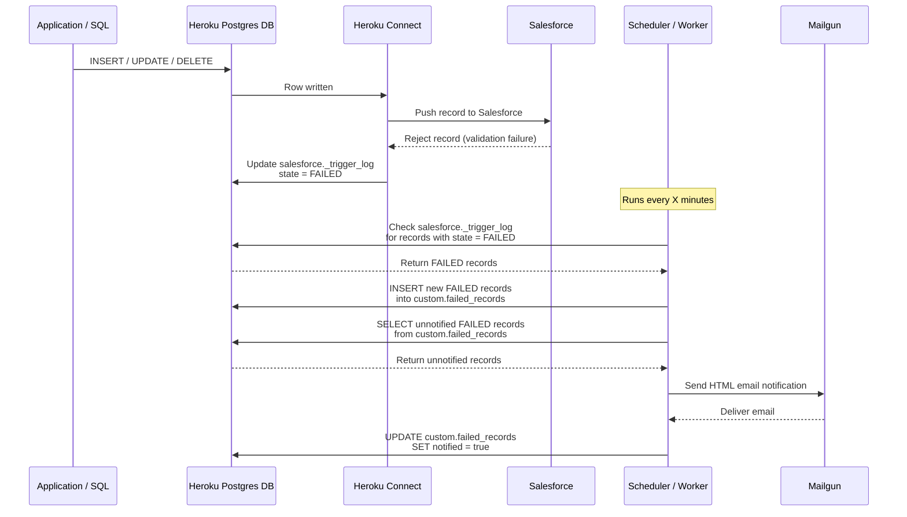

# poc-heroku-connect-failure-monitor

## Disclaimer

**The information provided in this repository is for informational and demonstration purposes only.** While reasonable efforts have been made to ensure the accuracy and completeness of the information, no warranties or guarantees are made regarding its reliability, accuracy, or completeness.

**Any actions taken based on the information provided are undertaken at your own risk.** The author shall not be held responsible or liable for any loss, damage, or other consequences arising from the use of this information.

**None of the tools, scripts, configurations, or other materials included in this repository are part of the Heroku Services or official Heroku product offerings. They are provided as examples or custom solutions and should be evaluated and tested appropriately before use in any environment.**

---

## Flow

```text
salesforce._trigger_log
        │
        │ SELECT state = 'FAILED'
        ▼
custom.failed_records
        │
        │ WHERE notified = false
        ▼
SendGrid / Mailgun Email
        │
        ▼
UPDATE notified = true
````

## Architecture Flow



## Components

* **Application / SQL**
* **Heroku Postgres DB**
* **Heroku Connect**
* **Salesforce**
* **Scheduler / Worker**
* **Mailgun**

## Detailed Flow

1. The application performs an `INSERT`, `UPDATE`, or `DELETE` operation on a Postgres table.

2. The row is written to the Heroku Postgres database.

3. Heroku Connect detects the change and processes the record for synchronization with Salesforce.

4. Heroku Connect attempts to push the record to Salesforce.

5. Salesforce rejects the record, for example, due to a validation rule failure.

6. Heroku Connect updates the corresponding entry in:

   ```text
   salesforce._trigger_log
   ```

   with:

   ```text
   state = FAILED
   ```

7. The Scheduler / Worker runs every X minutes and checks:

   ```text
   salesforce._trigger_log
   ```

   for records with:

   ```text
   state = FAILED
   ```

8. Newly detected failed records are inserted into:

   ```text
   custom.failed_records
   ```

9. The Scheduler / Worker selects failed records that have not yet been notified:

   ```sql
   SELECT *
   FROM custom.failed_records
   WHERE notified = false;
   ```

10. The system sends an HTML email notification through Mailgun.

11. Mailgun delivers the email to the configured recipients.

12. After the notification is successfully processed, the system updates:

```text
custom.failed_records
```

and sets:

```text
notified = true
```
